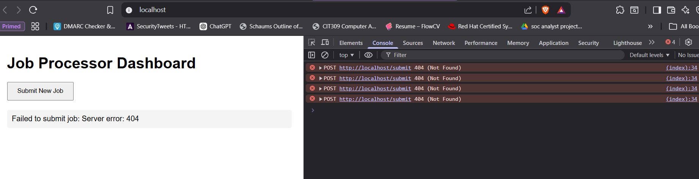
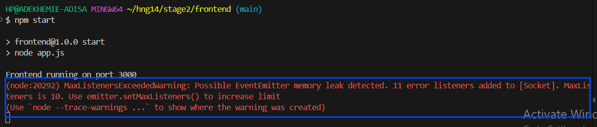
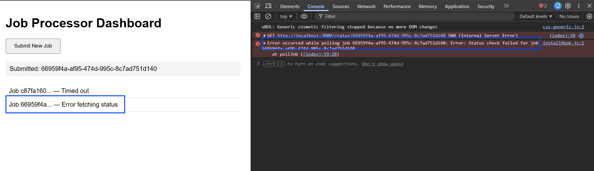
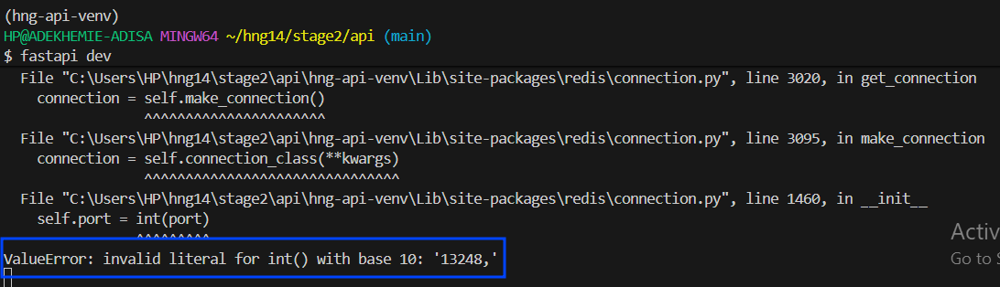

---

### 2. `FIXES.md`

```markdown
# Bug Fixes

This document details every bug encountered during the development, containerization, and CI/CD pipeline creation of this project.

---

## Frontend (HTML/JS)

### 1. Missing Error Handling for Network Requests
* **File:** `index.html` (Original)
* **Line:** `const data = await res.json();`
* **Issue:** If the backend returned a 500 error, `res.json()` would try to parse an HTML error page as JSON, crashing the script. No UI feedback was given for network failures.
* **Fix:** Wrapped fetches in `try/catch` blocks, added `if (!res.ok) throw new Error(...)`, and implemented UI state updates for errors.

### 2. Incorrect API Route in Frontend
* **File:** `index.html`
* **Line:** `fetch('/submit', { method: 'POST' })`
* **Issue:** Frontend was calling `/submit`, but FastAPI backend was explicitly defined as `@app.post("/jobs")`. Resulted in a 404 Not Found from Nginx.
* **Fix:** Updated fetch calls to match backend routes (`/jobs` and `/jobs/${id}`) and updated `nginx.conf` reverse proxy block to forward `/jobs`.

### 3. Created nginx.conf to serve as a reverse proxy

### 4. Incorrect API Route in Frontend
* **File:** `index.html`
* **Line:** `fetch('/submit', { method: 'POST' })`
* **Issue:** Frontend was calling `/submit`, but FastAPI backend was explicitly defined as `@app.post("/jobs")`. Resulted in a 404 Not Found from Nginx.
* **Fix:** Updated fetch calls to match backend routes (`/jobs` and `/jobs/${id}`) and updated `nginx.conf` reverse proxy block to forward `/jobs`.

 

---

## Backend (Python / FastAPI)

### 5. Remove hardcoded secrets
* **File:** `api/main.py, worker/worker.py`
* **Line:** `r = redis.Redis(host="localhost", port=6379, ...)`
* **Issue:** Redis connection strings (host, port, username, and in earlier iterations, passwords) were hardcoded directly into the Python source code
* **Fix:** Completely removed the hardcoded values. Implemented pydantic-settings (BaseSettings) in both files to dynamically inject connection details strictly from OS environment variables or .env files at runtime. The container image is now completely environment-agnostic

### 6. Create /health endpoint
* **File:** `api/main.py`
* **Line:** N/A (Route was entirely missing)
* **Issue:** The production Dockerfile included a HEALTHCHECK instruction configured to ping http://localhost:8000/health. However, FastAPI does not provide a /health route by default
* **Fix:** Added a dedicated health endpoint to main.py
```python
@app.get("/health")
def health_check():
    return {"status": "API is healthy"}
```

---

## Worker (Python)

### 6. Redis Port Passed as String
* **File:** `worker/worker.py`
* **Line:** `r = redis.Redis(host=..., port=os.getenv("REDIS_PORT"))`
* **Issue:** `os.getenv()` returns a string. The `redis-py` library requires `port` to be an integer, throwing a `TypeError`.
* **Fix:** Cast to int: `port=int(os.getenv("REDIS_PORT", 6379))`. (Later replaced entirely by Pydantic Settings type casting).

---

## Error Images



 


