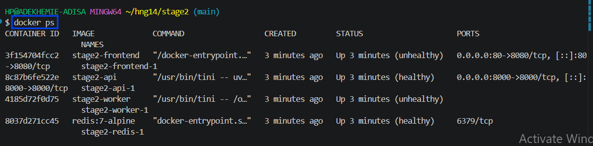
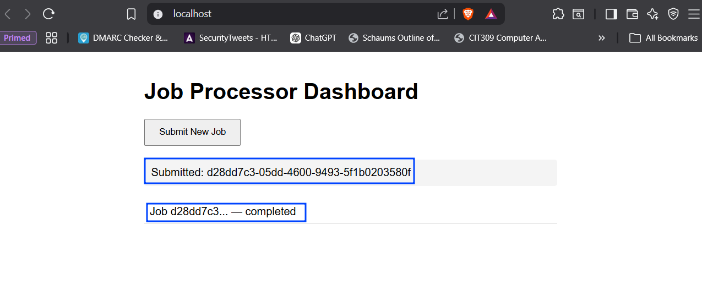

# hng14-stage2-devops

Deploying a multi-service application and make it production-ready through containerization and a full CI/CD pipeline.
This project is job-processing stack built with FastAPI, Redis, and Nginx. Jobs are submitted through a browser dashboard, queued in Redis, processed by a background worker, and their status is polled in real time.

---

## Architecture

```
Browser → Nginx (Reverse Proxy) → FastAPI → Redis ← Worker
```

| Service | Role |
|---|---|
| **Frontend** | Static HTML/JS served by Nginx, which also acts as a reverse proxy for API routes |
| **API** | FastAPI application that receives job requests and pushes them to Redis |
| **Worker** | Background Python process that listens to Redis, processes jobs, and updates their status |
| **Broker** | Redis instance used as a message queue and temporary data store |
| **Network** | All services communicate over an isolated internal Docker network. Redis is not exposed to the host machine |

---

## Prerequisites

| Tool | Version |
|---|---|
| [Docker](https://docs.docker.com/get-docker/) | 20.10+ |
| [Docker Compose](https://docs.docker.com/compose/install/) | 2.0+ |
| [Git](https://git-scm.com/) | Any recent version |

---

## Quickstart

### 1. Clone the repository

```bash
git clone https://github.com/cyberar/hng14-stage2-devops.git
cd hng14-stage2-devops
```

### 2. Configure environment variables

A `.env.example` file is provided. Copy it to create your active configuration:

```bash
cp .env.example .env
```

> **Note:** Open the newly created `.env` file and update `REDIS_PASSWORD`

### 3. Build and start the stack

```bash
docker compose up -d --build
```

---

## Verifying the Stack

Run `docker compose ps`. All four services should be running, and the `STATUS` column must eventually show `healthy` for each:



### Checking worker logs

To verify the system is actively processing jobs:

```bash
docker compose logs -f worker
```

Expected output:
```
Worker started. Listening for jobs...
```

---

## Usage

1. Open your browser and navigate to **http://localhost**
2. Click **Submit New Job**
3. The dashboard instantly shows the job as `queued`
4. Within 2–3 seconds the worker picks up the job, and the dashboard automatically updates to `completed` and stops polling



---

## Running Unit Tests Locally

To run the mocked unit tests without spinning up Docker:

```bash
cd api

# Create and activate a virtual environment
python -m venv venv
source venv/bin/activate        # On Windows: .\venv\Scripts\activate

# Install dependencies
pip install -r requirements.txt
pip install pytest pytest-cov

# Run tests with coverage report
pytest -v --cov=. --cov-report=term-missing
```
